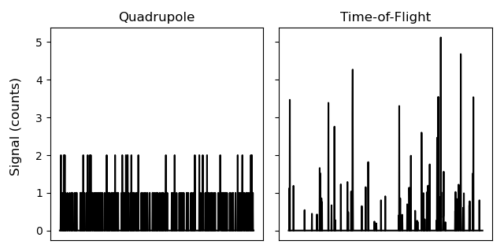
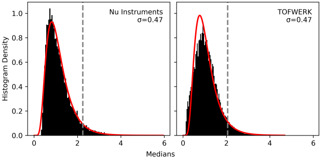
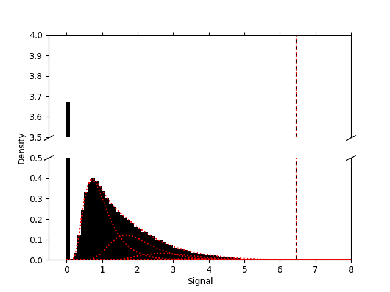

Thresholds for spICP-MS
=======================

Poisson
-------

At the very low counting rates often seen in spICP-MS work, the typical Gaussian statistics (:math:`\mu + 3 \sigma`) used to determine detection limits do not apply.
Instead Poisson statsitics should be used to determine the *critical value*, the threshold above which a signal is considered to be a detected particle [1]_ .
Confusingly, most Poisson statistics will also define a :term:`detection threshold`, but this should not be used to detemine the detection of signal.
There are a number of different (more or less permissive) formulas for determining these thresholds, most of which are implemented in SPCal.

spICP-ToF: Compound-Poisson
---------------------------

    
    The data produced by a ToF MS is non-integer.
   
The Poisson thresholding typically used for spICP-MS is not valid for spICP-ToF, as is easily established by looking at spICP-ToF data.
Unlike data from a quadrupole instrument, this data is non-integer.
To achieve sufficient resolution a time-of-flight instrument cannot be operated in pulse-counting mode, where the electron pulses from indiviual ions are counted as discrete (integer) events [2]_ .
Instead, the detectors in TOFs use the raw output of fast analouge-to-digital converters and this exposes the variation in current produced by an electron multiplier for a single ion, known as the pulse-height distribution (PHD) or single-ion area (SIA) [3]_ .
The result of multiple ions striking the detector is therefore a Poisson sampling of the PHD, where each ion may produce a range of values.

.. _sia:

    The single-ion areas of two ICP-ToF instruments, and log-normal fits.

To convert these values into counts the detector is calibrated to determine the SIA, typically by analysing a very low concentration sample, i.e. one that is likely to only produce single-ion events.
Multiple aquistions of raw data from the detector are summed and then normalised to approxmate the signal produced for 1 ion (count) by dividing by the mean of the recorded SIA.

Compound-Poisson sampling must be used to accurately determine a :term:`detection threshold` for spICP-ToF, ideally of the actual SIA of the instrument [3]_ .
In SPCal, this can be performed by brute force simulation or by using a log-normal approximation of the SIA.
For both methods, the lambda (mean) value of the Poisson is taken as the mean signal in the data set.
The simulation uses a given SIA distribution to generate a compound-Poisson distributed data and determines the threshold from the appropriate quantile of this data.
While accurate at high :term:`error rate` (:math:`>10^{-3}`) the computational cost to simulate enough samples for low :term:`error rate` is too high to be practical [4]_ .

Log-normal approximation
^^^^^^^^^^^^^^^^^^^^^^^^

   A spICP-ToF background and the corresponding log-normal approximation. Each log-normal (red) is summed to estimate the non-zero portion of the compound-Poisson distributed data.

The log-normal approximation works by closely appoximating the SIA with a log-normal distribution, see :numref:`sia`.
Since the cumulative density and quantile functions of a log-normal are known, we can then predict the resulting :term:`detection threshold` for the sum of log-normal distributions.
In the case of the log-normal approximation only the shape parameter (:math:`\sigma`) of the log-normal fit to the SIA is required.

Threshold selection
-------------------

.. list-table:: Selection of statistics for determining the :term:`detection threshold`.
   :header-rows: 1

   * - Number of non-zero values below 5 counts
     - NUmber of non-zero values :math:`\mathbb{Z} \pm 0.05`
     - Threshold method
   * - :math:`>5%`
     - 
     - Gaussian
   * - :math:`<5%`
     - :math:`>75%` 
     - Poissson
   * - :math:`<5%`
     - :math:`<75%`
     - compound-Poisson

The best method to find the :term:`detection threshold` will depend on the data being analysed.
SPCal will use aspects of the loaded sample to choose between using Gaussian, Poisson of compound-Poisson statistics.
For data that is consistently above five counts, Gaussian statistics are used, otherwise Poisson or compound-Poisson dending on the integer nature of the data.
Values are considered integer if they are within 0.05 of an integer value, as data exports from ICP-MS often seem to have a small offset from true integers.
The detection threhold is then calculated for the chosen :term:`error rate` (:math:`\alpha`).

Error rates
-----------

In other analytical techniques a 5% :term:`error rate` (:math:`\alpha = 0.05`) is considered acceptable and is frequently used implemented as the :math:`3 \sigma` rule.
However, the large number of events collected during spICP-MS makes such low :term:`error rate` lead to a very large number of false detections.
An :term:`error rate` of :math:`\alpha = 10^{-6}` is fairly standard and will lead to only 1 false detection per million events.

.. [1] Lockwood, T. E.; de Vega, R. G.; Clases, D. An Interactive Python-Based Data Processing Platform for Single Particle and Single Cell ICP-MS. Journal of Analytical Atomic Spectrometry 2021, 36 (11), 2536–2544. https://doi.org/10.1039/D1JA00297J.

.. [2] Gundlach-Graham, A.; Hendriks, L.; Mehrabi, K.; Günther, D. Monte Carlo Simulation of Low-Count Signals in Time-of-Flight Mass Spectrometry and Its Application to Single-Particle Detection. Anal. Chem. 2018, 90 (20), 11847–11855. https://doi.org/10.1021/acs.analchem.8b01551.

.. [3] Koppenaal, D. W.; Barinaga, C. J.; Denton, M. B.; Sperline, R. P.; Hieftje, G. M.; Schilling, G. D.; Andrade, F. J.; Barnes, J. H.; Iv, I. MS Detectors. Anal. Chem. 2005, 77 (21), 418 A-427 A. https://doi.org/10.1021/ac053495p.

.. [4] Ialongo, C. Confidence Interval for Quantiles and Percentiles. Biochem. med. (Online) 2019, 29 (1), 5–17. https://doi.org/10.11613/BM.2019.010101.
