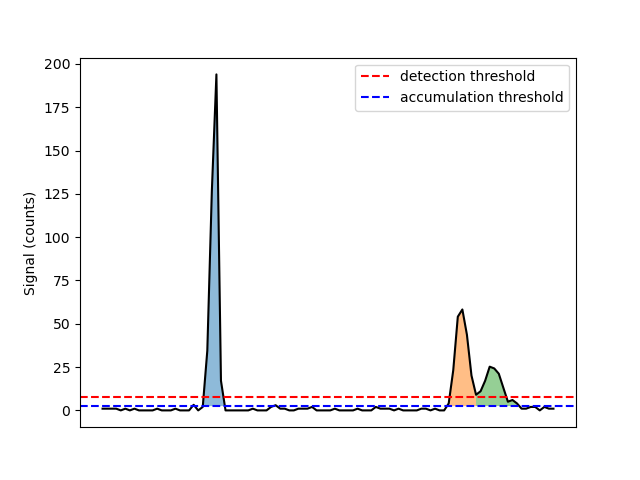

Thresholding Options
====================

.. _accumulation plot:

   Signal above the :term:`detection threshold` is detected as a particle.
   Contiguous regions above the :term:`accumulation threshold`, with at least one detection, are summed.

To resolve particles from background signals a :term:`detection threshold` must be defined, above with signal is considered a particle.
SPCal offers three different threholding methods, each with their own use-cases.
In general, Gaussian statistics should be used for thresholding singals with a high-mean background (> 10 counts) and Poisson statistics for thosfe below.
For spICP-ToF data with low-mean backgrounds, Compound-Poisson statistics must be used.
For more a detailed discussion see :ref:`Thresholds for spICP-MS`.
Each method also allows the definition of an error-rate :math:`\alpha`, that corresponds to the expected number of falsely detected particles.

The method used for data can be selected using *Threshold method* in the **Options Tab**, with the following options.

#. Automatic
   Selects the most appropraite of Compound-Poisson, Gaussian and Poisson.

#. Highest
   Selects the highest thrshold.

#. Compound-Poisson
   Uses Compound-Poisson statistics with the options in :ref: `Compound-Poisson options`.
   Reccomended for ToF data.

#. Gaussian
   Uses Gaussian statistics with the options in :ref: `Gaussian options`.
   Reccomended for data with a background signal > 10 counts.

#. Poisson
   Uses Poisson statistics with the options in :ref: `Poisson options`.
   Reccomended for data with a background signal < 10 counts.

#. Manual Input
   Enables setting the *Detection threshold* manually in the **Sample Tab** and **Reference Tab**.

SPCal also allows editing of the *Accumulation method*, to set the :term:`accumulation threshold`.

#. Detection threshold
   Uses the :term:`detection threshold`, as calculated above, as the :term:`accumulation threshold`.
   This effectively disables the :term:`accumulation threshold`.

#. Signal Mean
   Uses the signal mean as the :term:`accumulation threshold`.

#. Half-detection threshold
   Uses the value half way between the signal mean and :term:`detection threshold`.

Compound-Poisson options
------------------------

.. list-table:: Compound-Poisson options in the **Options Tab**.
    :header-rows: 0

    * - :math:`\alpha`
      - The (Type I) :term:`error rate`.
    * - Method
      - The method used: log-normal approximation or simulation.
    * - SIA :math:`\sigma`
      - The shape parameter used in the log-normal approximation.
    * - SIA Dist
      - The distribution used in the simulation, must be loaded from a file.

Details on the method :term:`detection threshold` is calculated using Compound-Poisson statistics can be found in :ref:`Thresholds for spICP-MS`.
To load a SIA distribution press the left-most button. This will start a dialog to import data.
The loaded distribution can be viewed using the center button, or cleared using the right-most button.

Gaussian options
----------------

.. list-table:: Gaussian options in the **Options Tab**.
    :header-rows: 0

    * - :math:`\alpha`
      - The (Type I) :term:`error rate` used to calculate the z-value.
    * - :math:`\sigma`
      - The z-value.

The :term:`detection threshold` is calculated using Gaussian statistics as follows, :math:`\mu + z \sigma`.
The z-value is calculated from :math:`\alpha` using the quantile function of a standard normal distribution.
Editing :math:`\alpha` or :math:`\sigma` will adjust the other value to match.

Poisson
-------

.. list-table:: Poisson options in the **Options Tab**.
    :header-rows: 0

    * - :math:`\alpha`
      - The (Type I) :term:`error rate`.
    * - Advanced Options
      - Opens a dialog to select the formula used to calculate the threshold.

The :term:`detection threshold` is calculated using the :math:`\alpha` and the formula selected in *Advanced Options*.
The strengths and weaknesses of each formula are discussed in the MARLAP manual [1]_.

Windowed thresholding
---------------------

Iterative threshoding
---------------------

.. [1] United States Environmental Protection Agency, MARLAP Manual Volume III: Chapter 20, Detection and Quantification Capabilities Overview. https://www.epa.gov/sites/default/files/2015-05/documents/402-b-04-001c-20_final.pdf
