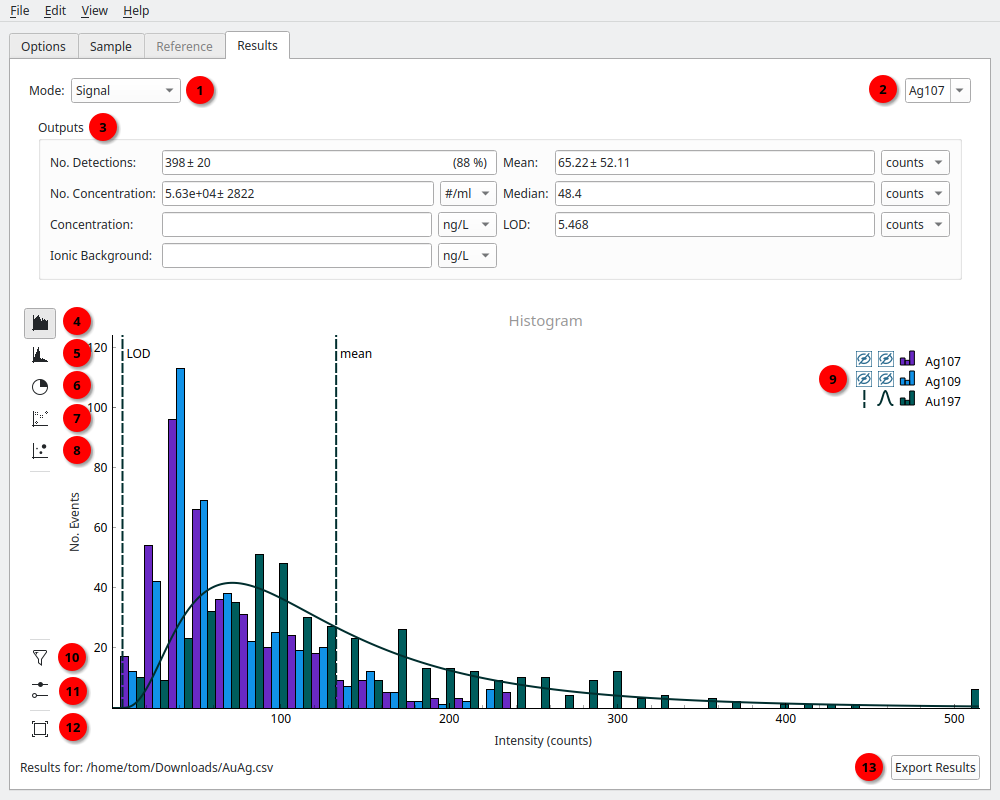
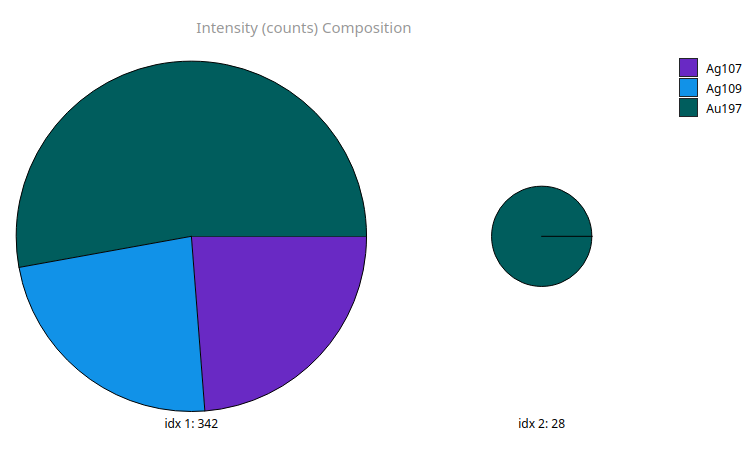
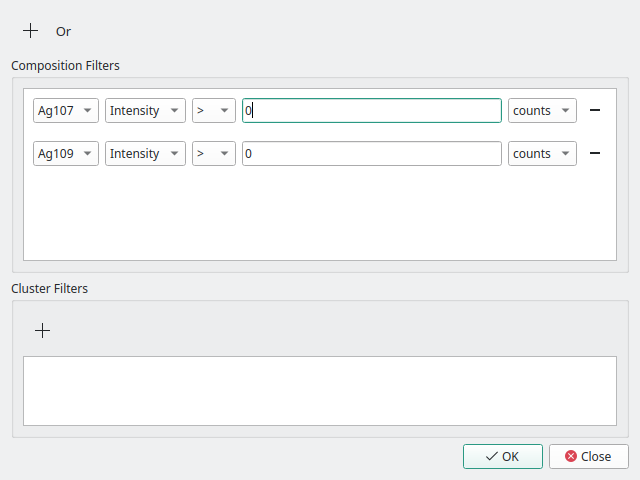
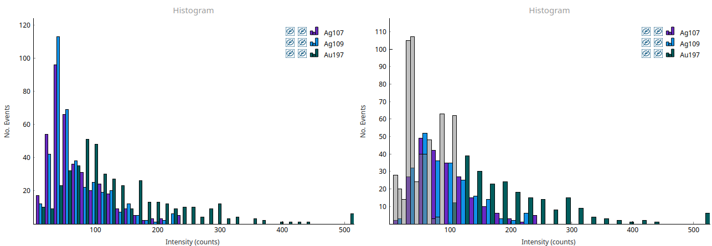

Processing Results
==================

.. _results label:

   The results tab, as shown for ToF data in the Multi-histogram view. (1) Mode selector, (2) Element selector, (3) Outputs, (4) Multi-histogram view, (5) Histogram view, (6) Compositions view, (7) Scatter view, (8) PCA view, (9) Legend, (10) Filter options, (11) Graph options, (12) View reset, (13) Export button.

The **Results Tab** is available once a sample is imported and one or more particles are detected.
Here you can via the distribution of signals, as well as sizes and masses if data has been :doc:`Calibrated <calibration>`.
For single-element (quadrupole) data, only the standard histrogram view ((5) :numref:`results label`) is avaiable.
This displays the data's distribution, a log-normal or normal fit to the histogram, and the mean and limit-of-detection.
The visiblity of these can be toggled by left-clicking the graph's legend ((9) :numref:`results label`).
The graph options for the Histogram and Multi-histogram views ((11) :numref:`results label`) let you set the histogram bin-width and the type of fit (normal or log-normal).

The results outputs ((3) :numref:`results label`) displays the calculated results for the currently selected element ((2) :numref:`results label`).
The *No. Dectections* shows the number of detected particles :math:`N` with their error taken as the :math:`\sqrt{N}`, so assumes Poisson counting statistics.
The fraction of total particles that contain the selected element is shown as a percent.

The *No. Concentration* is avaiable when the instrument :term:`uptake` is provided in the **Options Tab**.
The mass *Concentration* is available when the data can be calibrated into masses, see :doc:`Calibration <calibration>`.

*Ionic Background* shows the mean signal of non-detection areas (the gaps between particle signals) and can be calculated when the :term:`ionic response` is provided for an element.

Compositions
------------

.. _results composition:

   Results of hierarchical agglomerative clustering. The cluster index and size are shown below each cluster result.

The per-particle elemental composition can be calculated using spICP-ToF data and then displayed as a pir or bar chart using the Composition view ((6) :numref:`results label`).
Particle compostions are clustered using heirachcal-agglomerative clustering [1]_ and displayed (:numref:`results composition`).
The graph options ((11) :numref:`results label`) let you set the *Distance threshold*, *Minimum cluster size* and *Display mode* (bar or pie) for the clustering.
The *Distance threshold* sets the minimum distance to merge clusters, while the *Minimum cluster size* controls the smallest cluster to show (e.g. to prevent single-particle clusters).
The size of each cluster (number of particles) and index for filtering is shown below.

Filtering
---------

.. _results filter:

   The filter dialog can be used to restrict analysis of particles using a combination of boolean AND and OR operations.
   Additionally, data can be filtered using the cluster index following hierarchical agglomerative clustering.

The **Filtering Dialog** ((10) :numref:`results label`) can be used to select particles with certain characteristcs.
Particles can be selected based on their signal, mass or size for one or more elements, using boolean (AND, OR) operations.
The example in :numref:`results filter` uses the boolean AND of the two silver isotopes, 107 and 109, with signals greater than 0 counts.
This filters particle detections and results to only those that contain both silver isotopes.

.. _results filtered:

   Data before and after filtering particles containing Au197 > 100 counts.
   Filtered particles are shown in grey.

The Histogram views ((4, 5) :numref:`results label`) and Scatter view ((7) :numref:`results label`) can show filtered detections in grey, as in :numref:`results filtered`.
This is done by selecting *Draw filtered detections* in the graph options ((11) :numref:`results label`) for the relevant view.

.. [1] Tharaud, M.; Schlatt, L.; Shaw, P.; Benedetti, M. F. Nanoparticle Identification Using Single Particle ICP-ToF-MS Acquisition Coupled to Cluster Analysis. From Engineered to Natural Nanoparticles. J. Anal. At. Spectrom. 2022, 37 (10), 2042–2052. https://doi.org/10.1039/D2JA00116K.
