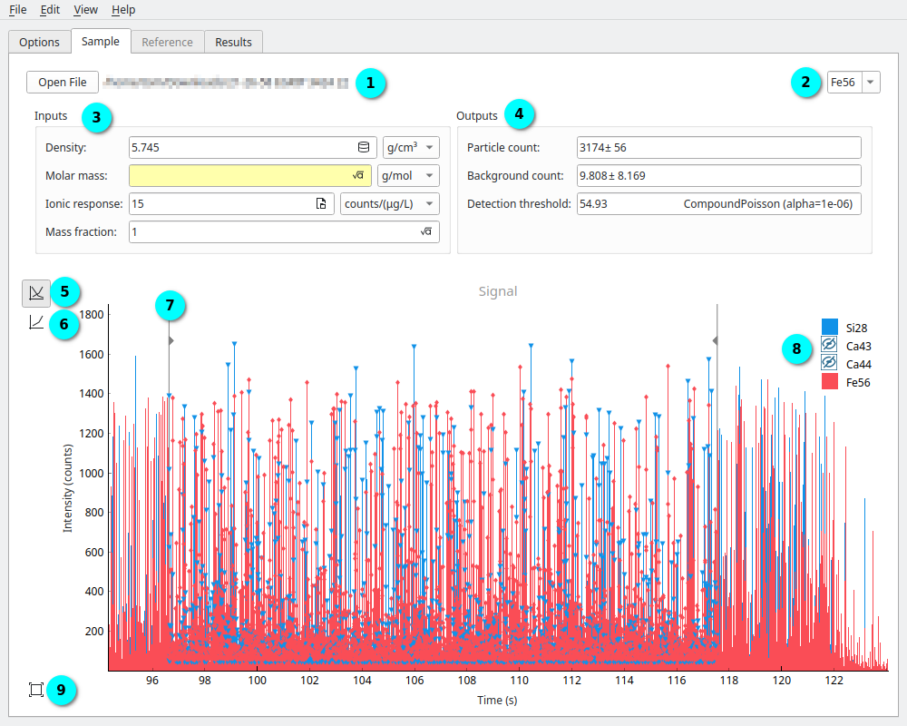

Viewing Data
============

.. _sample label:

   The **Sample Tab** shows the currently loaded sample data. |c1| Current file, |c2| Current element, |c3| Sample parameters for selected element, |c4| Outputs for selected elements, |c5| Multi-element plot, |c6| Single element plot, |c7| Trim control, |c8| Legend, |c9| Reset zoom.

Files loaded into SPCal will be shown in the **Sample Tab**, as in :numref:`sample label`.
This tab shows the loaded signal data for all elements, and element specific options and outputs.

The plot of sample data can be navigated using the left-mouse to scroll the view and mouse-wheel to zoom.
The y-axis of the plot is automatically scaled to show the maximum currently visible signal value.
The *trim controls* (|c7| :numref:`sample label`) can be used to trim data, limiting the region of analysis.
When the single element histogram is used (|c6| :numref:`sample label`) the mean and detection threhold are also shown.

.. |c1| unicode:: U+2460
.. |c2| unicode:: U+2461
.. |c3| unicode:: U+2462
.. |c4| unicode:: U+2463
.. |c5| unicode:: U+2464
.. |c6| unicode:: U+2465
.. |c7| unicode:: U+2466
.. |c8| unicode:: U+2467
.. |c9| unicode:: U+2468
