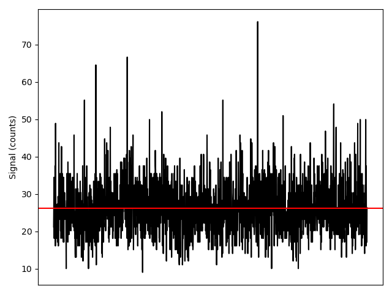
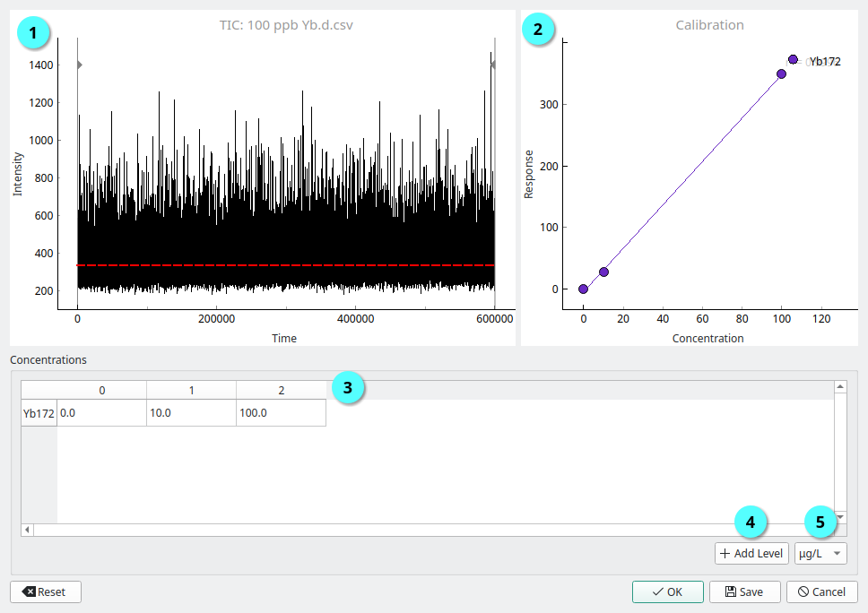

Tools
=====

Density Database
----------------

The **Density Database** is a library containing the :term:`density` for elements [1]_, common inorganic materials [2]_ and polymers [3]_.
The database is searchable using the formula, name or CAS number of a compound.
If started from the **Sample Tab** :term:`density` field, double-clicking a compound or selecting and pressing *Ok* will populate that field with the selected value.

Ionic Response Calculator
-------------------------

.. _ionic response example:

    Measurement of a dissolved standard, the mean of the signal (red line) can be used to determine the :term:`ionic response`.

To calculate the :term:`ionic response` one or more dissolved standards must be run under the same conditions as the spICP-MS sample.
When one standard is used, the :term:`ionic response` is taken as the mean value of the data, :numref:`ionic response example`.
When two or more are used, a calibration curve is created, with the :term:`ionic response` taken as the slope of that curve.

Ideally a blank and several dissolved standards are analysed, covering the range of signal produced by nanoparticles in the sample.
In practice, a blank and one standard are usually sufficient.
As the :term:`ionic response` will change day-to-day with instrument conditions so should be determined every run.

.. _ionic response dialog:

   The **Ionic Response Calculator**. |c1| The currently loaded data and mean (red), |c2| Calibration curve, |c3| Concentration table, |c4| Import data for new level, |c5| Concetration units.

The **Ionic Response Calculator** is used to calculate the :term:`ionic response` using one or more data files.
To use the calculator import one or more data files (|c4| :numref:`ionic response dialog`) and set their corresponding concentrations in the concentration table (|c3| :numref:`ionic response dialog`).
For information on importing data see :ref:`Data Import`.

Once all levels are imported the :term:`ionic response` (the calibration slope) and calibrations can be exported using the *Save* button.
If the **Ionic Response Calculator** was started from an :term:`ionic response` field in the **Sample** or **Reference Tab** then pressing *Ok* will automatically fill that field.

Mass Fraction Calculator
------------------------

.. figure:: images/tools_mass_fraction.png
   :align: center

   The **Mass Fraction Calculator** calculates the :term:`molar mass` (here MW=215.8 g/mol) and the :term:`mass fraction` from an input formula.
   The element for which the :term:`mass fraction` will be returned is highlight in bold.

This calculator computes the :term:`molar mass` and the :term:`mass fraction` of the first element from a given formula.
For example, the formula ``FeMoO4`` will give the :term:`mass fraction` for iron and ``MoFeO4`` the :term:`mass fraction` for molybdenum.
When started from the *Molar mass* or *Mass fraction* fields on the **Sample Tab** and **Reference Tab**, the corresponding field will be filled.

.. |c1| unicode:: U+2460
.. |c2| unicode:: U+2461
.. |c3| unicode:: U+2462
.. |c4| unicode:: U+2463
.. |c5| unicode:: U+2464

.. [1] National Library of Medicine PubChem Periodic Table of Elements. https://pubchem.ncbi.nlm.nih.gov/periodic-table/
.. [2] Kholodovych, V.; Welsh, W. J. Densities of Amorphous and Crystalline Polymers. In Physical Properties of Polymers Handbook; Mark, J. E., Ed.; Springer New York: New York, NY, 2007; pp 611–617. https://doi.org/10.1007/978-0-387-69002-5_37.
.. [3] Yaws, C. L.; Chen, D. H. Density of Solid—Inorganic Compounds. In Thermophysical Properties of Chemicals and Hydrocarbons; Elsevier, 2009; pp 296–308. https://doi.org/10.1016/B978-081551596-8.50011-0.
