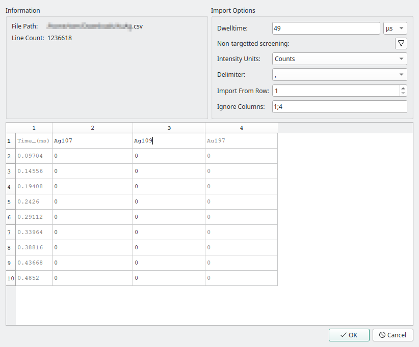
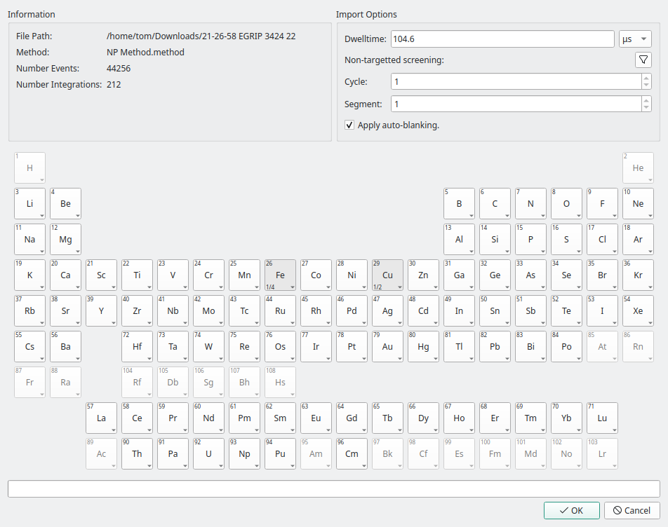
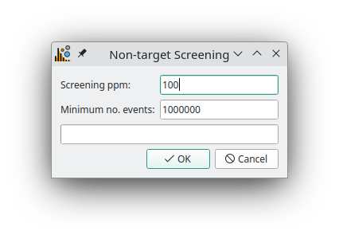
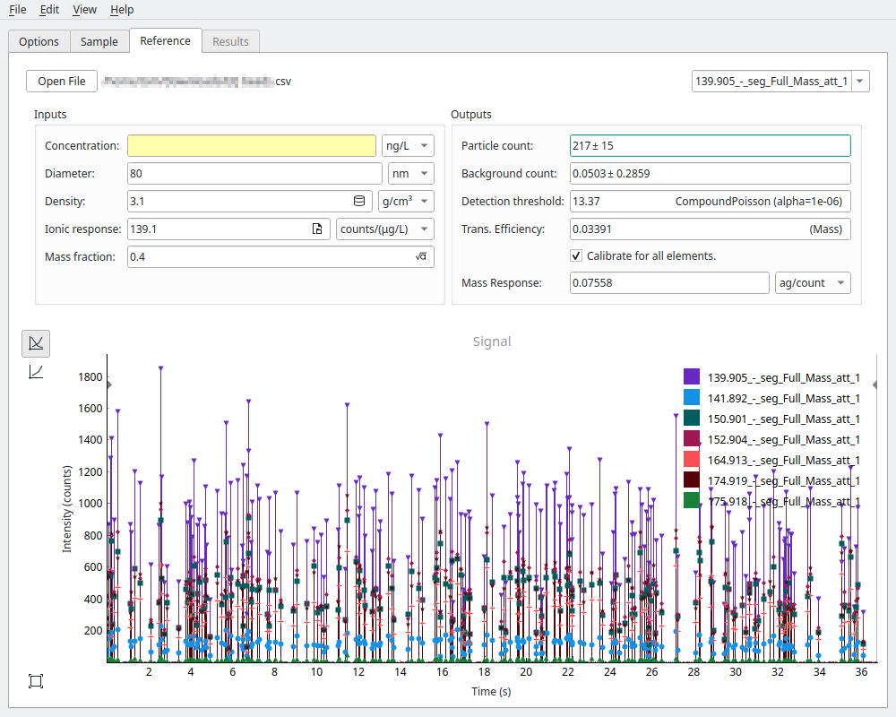

Data import
===========

The first step to performing any data processing is to load the data into SPCal.
SPCal supports import of delimited text files, which can be exported from instrument vendor software, and the raw data of Nu Instruments and TOFWERKs ICP-ToFs.
Data files can be loaded from the **File -> Open Sample File** or by drag-and-drop of files into the **Sample** tab

Text files
----------

.. _text import wizard:

   The import wizard for delimited text files.

Opening a text file will start the text import wizard. This wizard allows you to select which columns in the file to import and skip any non-data rows.
The wizard will attempt to guess the correct options when the file is loaded, a description of each option is shown in :numref:`tabtextoptions`.
The wizard displays the first 10 lines from the file (:numref:`text import wizard`) and is used to identify and remove non-data rows and columns before import.
In the example in :numref:`text import wizard`, there are 0 header rows so import proceed from row 1, and column 1 consists of non-particle data.
The first non-header row should contain the names of each column and is editable by double-clicking.

.. _tabtextoptions:
.. list-table:: Options for the text import wizard.
    :header-rows: 1

    * - Option
      - Description
    * - Dwelltime
      - The instrument event acquistion time. Calculated from data when a column with ``time`` in the title is included.
    * - Intensity Units
      - Selects if data is in *counts* or *counts-per-second (CPS)*. Defaults to counts unless *CPS* is included in the file header.
    * - Delimiter
      - The delimiter character.
    * - Import From Row
      - Skips the first *x* rows of the file (the header). The first non-skipped row should be the column names.
    * - Ingnore Columns
      - A ``;`` delimited list of which columns to ignore. For example time or index rows should not be imported.

ToF Data
--------

.. _tof import wizard:

   The import wizard for Nu Instruments and TOFWERKs ToF data.

SPCal supports import of ICP-ToF data from both Nu Instruments and TOFWERK instruments.
Nu Instruments data is stored in a single directory consiting of a number of ``.integ`` files with an index file (``integrated.index``) and  ``run.info`` file that stores run parameters.
To load Nu Instruments data, either drag-and-drop the directory into the **Sample** tab, or select the ``run.info`` file via **File -> Open Sample File**.
This starts the ToF import wizard, where you can select which elements / isotopes to import. Options for the ToF import wizard are summarised below in :numref:`table tof options`.

.. _table tof options:
.. list-table:: Options for the ToF data import wizard.
    :header-rows: 1

    * - Option
      - Description
    * - Dwelltime
      - The instrument event acquistion time, read from data on load.
    * - Cycle (Nu Instruments)
      - ToF cycle to load, defaults to 1.
    * - Segment (Nu Instruments)
      - ToF segment to load, defaults to 1.
    * - Apply Auto-Blanking (Nu Instruments)
      - Blank out sections of data with over-range signal. These sections are replaced with NaN values.
    * - Additional Peaks (TOFWERKs)
      - Non-element peaks to import, e.g. ArH+.
    * - Force Peak Integration (TOFWERKs)
      - Re-integrate raw data, even if integrated data exists.

Non-target Screening
--------------------

.. _non target screen:

   The non-target screening options available for the text and ToF importers.

Both the text and ToF import wizards (:numref:`text import wizard`, :numref:`tof import wizard`) have the option to screen data for elements of interest, by pressing the **Non-targetted screening** button.
This will search the first ``Minimum no. events`` events of the imported data file for elements / isotopes with greater than ``Screening ppm`` detections per million events.

Calibration
===========

One of the advantages of spICP-MS is its ability to calculate the size and mass distribution of particles.
This is performed by calibrating particle signals (in counts) to mass using the instrument :term:`ionic response`, and then to size using a known particle :term:`density`.

The :term:`transport efficiency` is the fraction of sample that makes it through to detection and must also be determined before calibration can occour.
With the exception of total-consumption nebulisers (100% efficiency) it is typically 2-10%.
The :term:`transport efficiency` (:math:`\eta`) can be entered manually if known (see Pace et al. [1]_ for examples), or calulated based on the reponse of a well characterised reference particle.

Reference Particle
------------------

.. _calibrate reference tab:

   The Reference tab is used to calculate the transport efficiency.
   This is required to calibrate data from signal into mass and size.

To use a reference particle select *Reference Particle* as the :term:`transport efficiency` option in the **Options Tab**.
This enables the **Reference Tab**, where data for the reference particle can be loaded via drag-and-drop or **File -> Open Reference File**.
See `Data Import`_ for details on importing data.

To correctly calibrate, the particle :term:`diameter`, :term:`density` and :term:`ionic response` must be enetered in the **Reference Tab** and the instrument :term:`uptake` in the **Options Tab**.
Ideally a particle of a single element is used, if one containing multiple is used then the :term:`mass fraction` of the measured element must be entered.
If the concentration of the reference particle solution is known then the accuracy of the calculation will be greater.
Once all parameters are input, the calculated efficiency is shown in the **Reference Tab** outputs section.

The :term:`transport efficiency` is usually assumed to be idependent of mass and a single element can be used to calibrate the entire mass range.
Selecting the *Calibrate for all elements* will use the currently selected element in the **Reference Tab** to determine the :term:`transport efficiency`.
If not selected, each element will *only calibrate data with the same element name* in the **Sample Tab**.

Mass Response
-------------

Limited calibration can also occur with the :term:`transport efficiency` by determining the :term:`mass response` from a reference particle.
After selecting *Mass Response* as the :term:`transport efficiency` option in the **Options Tab** the calibration proceeds as above in the `Reference Particle`_ section.
Using the :term:`mass response` eliminates the need for instrument :term:`uptake` and :term:`ionic response` but can only calibrate signals into masses.

..
.. Options Tab
.. ===========
..
..
.. The options tab holds instrument parameters used calibrate particle signal into mass and size, and thresholding parameters that determine how particles are detected.
.. Instrument options are
..
.. .. _table instrument options:
.. .. list-table:: Intstrument parameters.
..     :header-rows: 1
..
..     * - Option
..       - Description
..     * - Uptake
..       - The uptake (flow) rate of the sample. This can be determined gravimetrically through the change in sample mass over time.
..     * - Dwelltime
..       - The total acqusition time per event. This is defined at import and is *not editable*.
..     * - Transport efficiency

.. [1] Pace, H. E.; Rogers, N. J.; Jarolimek, C.; Coleman, V. A.; Higgins, C. P.; Ranville, J. F. Determining Transport Efficiency for the Purpose of Counting and Sizing Nanoparticles via Single Particle Inductively Coupled Plasma Mass Spectrometry. Anal. Chem. 2011, 83 (24), 9361–9369. https://doi.org/10.1021/ac201952t.
