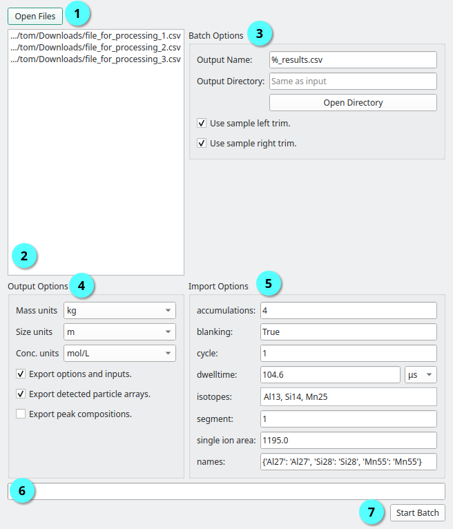

Batch Processing
================

When a large number of samples are collected in the same experiment, individually importing, processing and exporting data can be tedious.
The **Batch Process Dialog** can be used to automate this process, using the parameters for the currently loaded sample.
One sample file can be imported, the thresholding and calibration options set, and then these applied to the rest of the samples.

.. _batch dialog:

   The **Batch Process Dialog** is used to apply the current processing paramters to new files. |c1| Button to load files, |c2| Processing file list, |c3| Output name and trim options, |c4| Export options, |c5| Current data import options, |c6| Progress bar, |c7| Start / stop processing.

The **Batch Process Dialog** is available via **File -> Batch Processing** once a file with at least one detection has been loaded (see :ref:`Data Import`).
To load new files for processing, press the *Open Files* button (|c1| :numref:`batch dialog`).
Once opened files will appear in the file list |c2| :numref:`batch dialog` and can be removed by selecting them and pressing the *delete* key.
The batch options (|c3| :numref:`batch dialog`) can be used to change the output name and directory.
The output directory can be changed using the *Open Directory* button, and the name via the *Output Name* text field.
This field sets the exported data's file name, with ``%`` representing the input file name, i.e. for the *Output Name* ``%_out.csv``, ``input.csv`` will become ``input_out.csv``.
The *Use sample left/right trim* options will apply the trims set in the **Sample Tab** to files during batch processing.

The output options (|c4| :numref:`batch dialog`) are the same as described in :ref:`Data Export`.
The import options (|c5| :numref:`batch dialog`) are the parameters used during importing the current sample file (see :ref:`Data Import`).
These are used to import files in the file list, so *all files should have the same file format!*

Once all options are set pressing the *Start Batch* (|c7| :numref:`batch dialog`) will start the processing.

.. |c1| unicode:: U+2460
.. |c2| unicode:: U+2461
.. |c3| unicode:: U+2462
.. |c4| unicode:: U+2463
.. |c5| unicode:: U+2464
.. |c6| unicode:: U+2465
.. |c7| unicode:: U+2466
