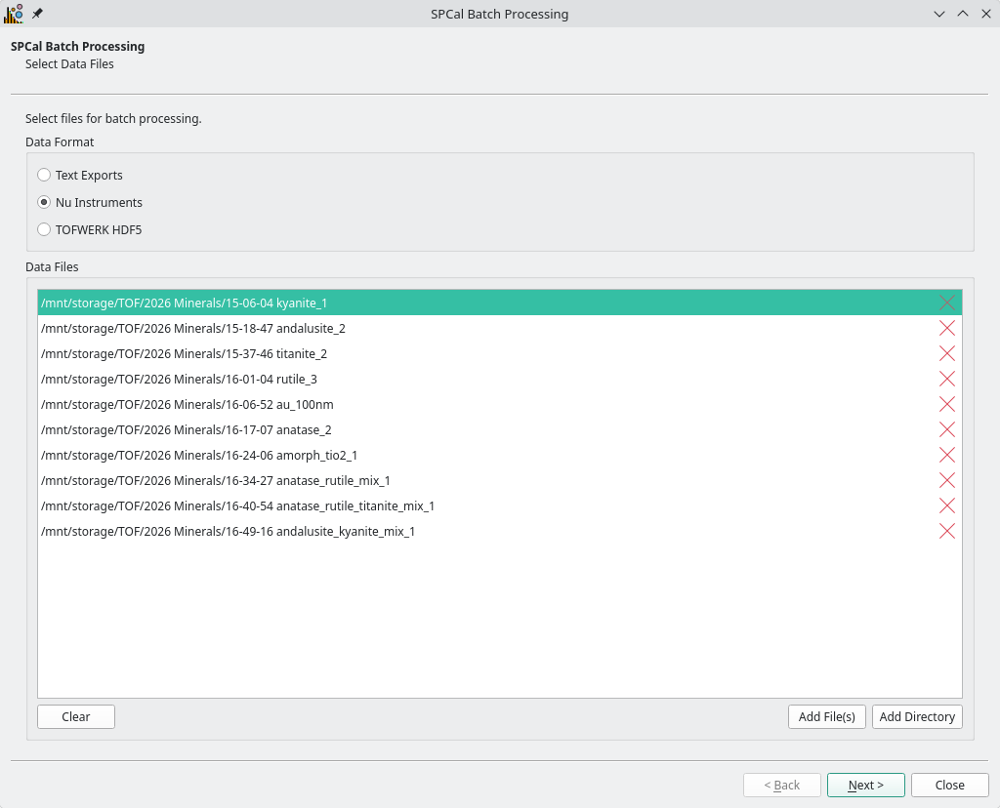
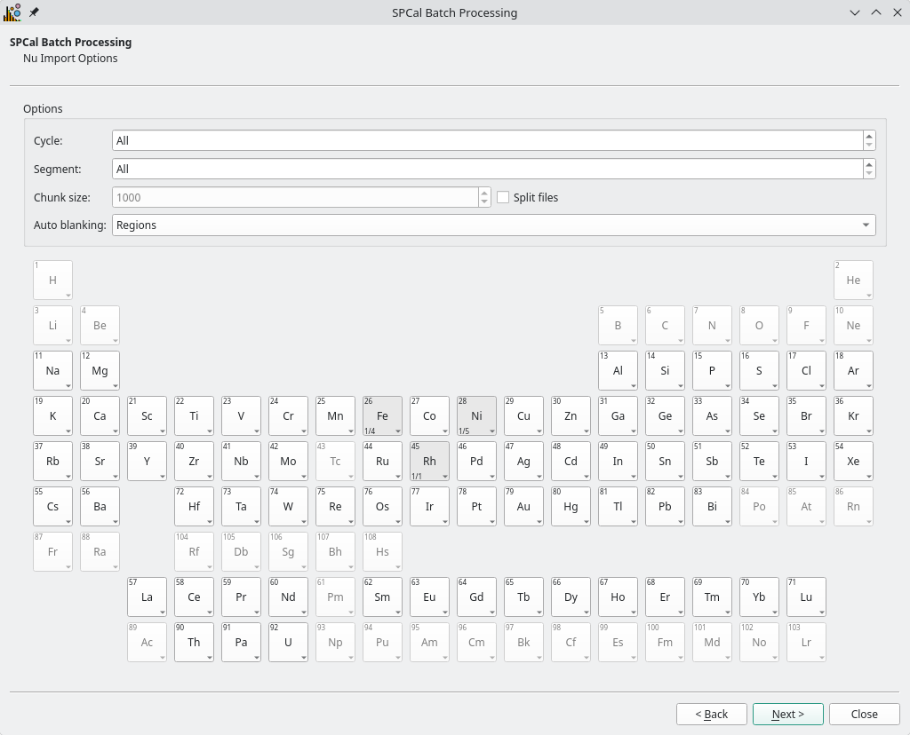
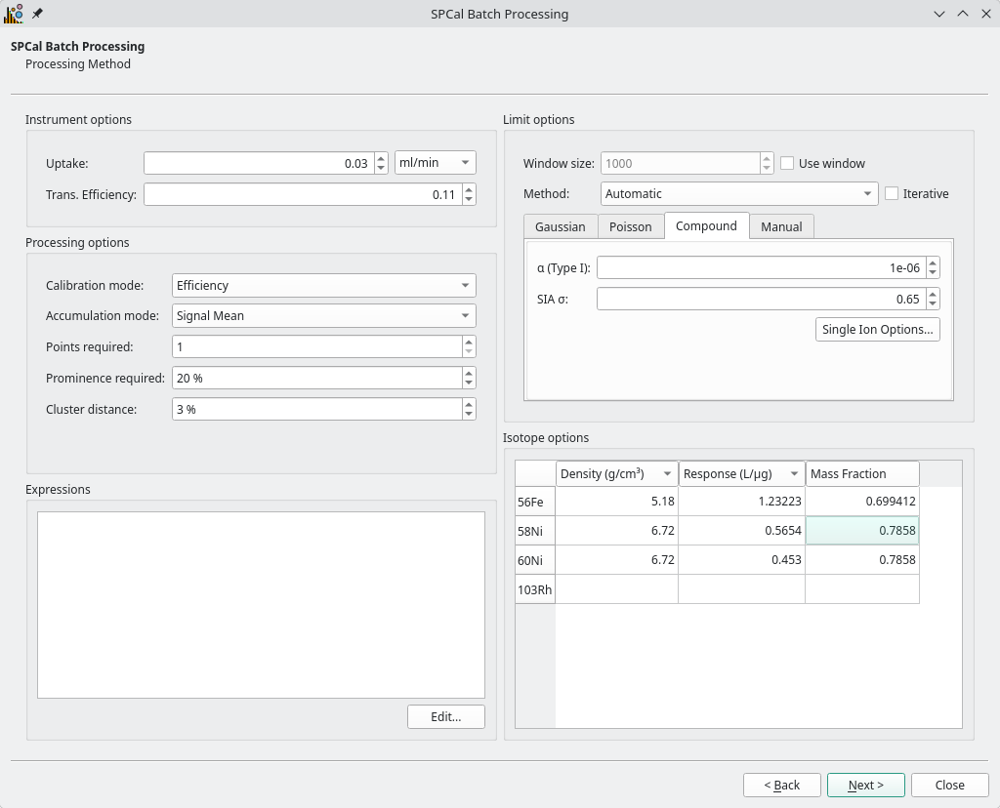
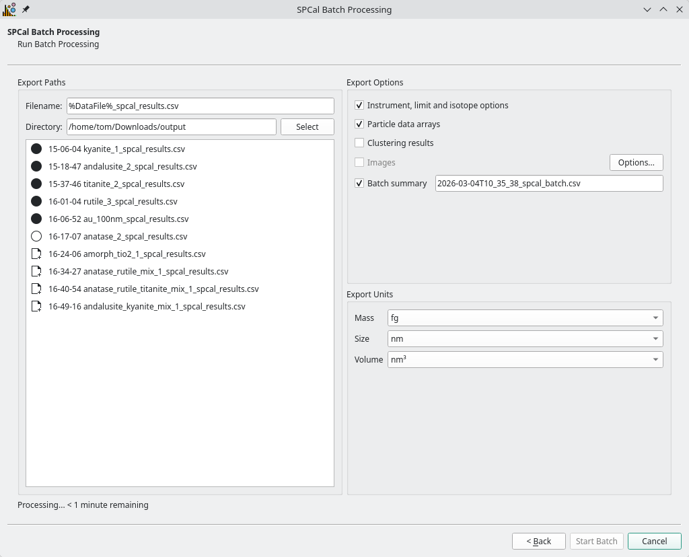

Batch Processing
================

When a large number of samples are collected in the same experiment, individually importing, processing and exporting data can be tedious.
The **Batch Process Wizard** can be used to automate this process and is started via **File -> Batch Processing**.

.. _batch wizard files page:

   The files page of the Batch Processing Wizard.

:numref:`batch wizard files page` is the first page of the wizard, and is used to select the format of the files to be processed and their paths.
First select the format, either *Text Exports* (.csv), *Nu Instruments* or *TOFWERK HDF5* (.h5).
Files can then be add to the data file list using the *Add File(s)* button.
The *Add Directory* button will recursively search the selected directory for mathcing files and add all to the data file list.

.. _batch wizard format page:

   The format page of the Batch Processing Wizard for Nu Instruments files.

The layout of the format page (:numref:`batch wizard format page`) depends on the format of the data files being processed.
Here you can specify the isotopes for processing and data file import options, see :ref:`Data Import` for details.
For Nu Instruments files the *Chuck Size* option can be used to split large data files into chunks before processing, for memory limited systems.

.. _batch wizard method page:

   The method page of the Batch Processing Wizard.

The page in :numref:`batch wizard method page` is used to define and check the parameters of the method used to process data.

.. note::
   The values of the current method in SPCal will be used as defaults in the :ref:`batch wizard method page`.

For Nu Instruments files the *Chuck Size* option can be used to split large data files into chunks before processing, for memory limited systems.

.. _batch wizard run page:

   The final page of the Batch Processing Wizard, where the batch processing is started.

The final page (:numref:`batch wizard run page`) is used to select what kind of data is output and where.
The directory to export to is set using the *Directory* field, with each result named using the *Filename* field. 
The placeholder %DataFile% will be replaced with the name of the data file and is previewed in the data file list below.

Options for export are defined in the :numref:`batchrunoptions` and units under *Export Units*.

.. _batchrunoptions:
.. list-table:: Export options for the batch processing wizard.
    :header-rows: 1

    * - Option
      - Description
    * - Instrument, limit and isotope options
      - Outputs the parameters used for processing and calibrating data.
    * - Particle data arrays
      - Outputs a line for each particle with its time, signal (in cts, and calibrated units) and cluster ID (if clustering enabled).
    * - Clustering results
      - Outputs the counts and mean of each istope per cluster. Also enabled cluster ID in particle data arrays.
    * - Images
      - Output images for each file, *currently not implemented*.
    * - Batch summary
      - Output a summary of all data files as a flat array (File,Isotope,Name (e.g., Mean),Unit,Value).

To start processing press *Start Batch*.
The icon next to each file will change from an empty to full circle as the file is processed and an estimate of the remaining time is shown at the bottom of the page.
Once started, the batch can be interrupted by clicking *Cancel*.
Once finshed the batch wizard can be closed.
