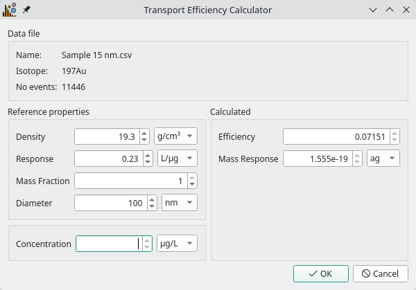

Calibration
===========

One of the advantages of spICP-MS is its ability to calculate the size and mass distribution of particles.
This is performed by calibrating particle signals (in counts) to mass using the instrument :term:`ionic response`, and then to size using a known particle :term:`density`.

The :term:`transport efficiency` is the fraction of sample that makes it through to detection and must also be determined before calibration can occur.
With the exception of total-consumption nebulisers (100% efficiency) it is typically 0.02 - 0.1 (2 - 10%).
The :term:`transport efficiency` (:math:`\eta`) can be entered manually if known (see Pace et al. [1]_ for examples), or calculated based on the response of a well characterised reference particle.

The method used in SPCal can be selected in the **Edit -> Processing Options** dialog.
A full description of the calibration methods used in SPCal is available in a previous publication [2]_ .

Reference Particle
------------------

.. _transport efficiency calculator:

   The Transport Efficiency Calculator is enabled once particles are detected and a instrument iptake rate is input.

To calculate :term:`transport efficiency` using a reference particle first load the data into SPCal, see :ref:`Data Import`.
Then input the instrument :term:`uptake` to enable the efficiency calculator button, next to the *Trans. Efficiency* input.
Clicking this button opens the calculator in :numref:`transport efficiency calculator` using the currently selected data file and isotope.

To correctly calibrate, the particle :term:`density`, :term:`ionic response`, :term:`diameter` must be entered into the calculator.
Ideally a particle of a single element is used, if one containing multiple is used then the :term:`mass fraction` of the measured element must be entered.
If the mass concentration of the reference particle solution is known then the accuracy of the calculation will be greater.
Once all parameters are input, click *OK* to apply the efficiency top the instrument method.

The :term:`transport efficiency` is usually assumed to be independent of mass and a single element can be used to calibrate the entire mass range.

Mass Response
-------------

Limited calibration can also occur with the :term:`transport efficiency` by determining the :term:`mass response` from a reference particle.
Using the :term:`mass response` eliminates the need for instrument :term:`uptake` and :term:`ionic response` but can only calibrate signals into masses.

.. [1] Pace, H. E.; Rogers, N. J.; Jarolimek, C.; Coleman, V. A.; Higgins, C. P.; Ranville, J. F. Determining Transport Efficiency for the Purpose of Counting and Sizing Nanoparticles via Single Particle Inductively Coupled Plasma Mass Spectrometry. Anal. Chem. 2011, 83 (24), 9361–9369. https://doi.org/10.1021/ac201952t.

.. [2] Lockwood, T. E.; de Vega, R. G.; Clases, D. An Interactive Python-Based Data Processing Platform for Single Particle and Single Cell ICP-MS. Journal of Analytical Atomic Spectrometry 2021, 36 (11), 2536–2544. https://doi.org/10.1039/D1JA00297J.
