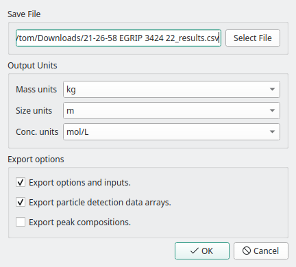

Data Export
===========

.. _export options:

   The export options dialog allows you to select what data is exported.

Exporting results is performed by pressing the *Export Results* button in the **Results Tab**.
This opens the dialog shown in :numref:`export options`, where options for exporting can be entered.
The filename of the export is set to *Save File*, and can be selected by pressing *Select File*.
By default the export name will be the imported sample filename with ``_results.csv`` appended.
The units of exported masses, sizes and concentrations can be set using the *Output Units* controls, and default to SI units.
Finally, the *Export options* control what extra data is written to the file.
All exports will contain particle numbers, concentrations, backgrounds, the mean and median of signal, size and mass, and limits of detection.

Checking *Export options and inputs* will save parameters such as the :term:`dwelltime`, instrument :term:`uptake` and particle :term:`density` to the file.
Checking *Export paraticle detection data arrays* will save the particle signals and any calibrated data to the end of the file.
Each row of this data is a single detection with columns of elements and units, particles may contain one or more elements and are blank when that element is not detected. An example is shown below.

.. code-block:: 

    # Raw detection data
    Al27     ,Si28     ,Fe56     ,Fe56
    counts   ,counts   ,counts   ,kg
    1477.1984,3324.832 ,285.52759,8.389378E-19
    31.392302,         ,         ,
             ,251.97623,820.53406,2.410895E-18
             ,491.5755 ,         ,
             ,         ,283.00967,8.3153966E-19
             ,         ,66.157867,1.9438519E-19

The last export option, *Export peak compositions*, will add the particle composition clusters to the file, shown below.
Each row contains the mean fraction (and error) for each element and the number of particles (``count``) per cluster.
This option will also add the cluster index (which cluster a particle belongs to) as a column to the data array export.

.. code-block::

    # Peak composition,count,Al27  ,error   ,Si28  ,error   ,Fe56  ,error
    # Signal          ,20241,0.1261,0.1584  ,0.2588,0.3119  ,0.6151,0.3542
                      ,1682 ,1     ,0       ,0     ,0       ,0     ,0
                      ,5    ,0.7344,0.004635,0     ,0       ,0.2656,0.004635
                      ,3    ,0.7838,0.003697,0.2162,0.003697,0     ,0
