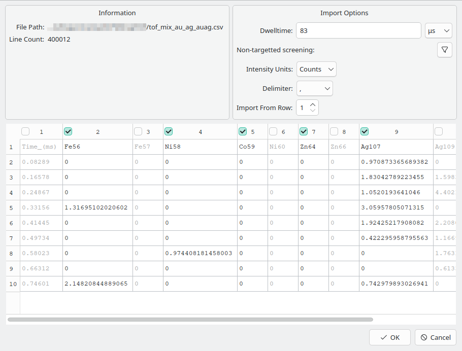

Data Import
===========

The first step to performing any data processing is to load the data into SPCal.
SPCal supports import of delimited text files, which can be exported from instrument vendor software, and the raw data of Nu Instruments and TOFWERKs ICP-ToFs.
Data files can be loaded from the **File -> Open Sample File** or by drag-and-drop of files into the **Sample Tab**.

Text Files
----------

.. _text import wizard:

   The import wizard for delimited text files.

Opening a text file will start the text import wizard. This wizard allows you to select which columns in the file to import and skip any non-data rows.
The wizard will attempt to guess the correct options when the file is loaded, a description of each option is shown in :numref:`tabtextoptions`.
The wizard displays the first 10 lines from the file (:numref:`text import wizard`) and is used to identify and remove non-data rows and columns before import.
In the example in :numref:`text import wizard`, there are 0 header rows so import proceed from row 1, and column 1 consists of non-particle data.
The first non-header row should contain the names of each column and can be edited by double-clicking the name.
Columns can be selected or ignore using their corresponding checkboxes, to quickly select one column click it while holding the *Shift* key.

.. _tabtextoptions:
.. list-table:: Options for the text import wizard.
    :header-rows: 1

    * - Option
      - Description
    * - :term:`dwelltime`
      - The instrument event acquisition time. Calculated from data when a column with ``time`` in the title is included.
    * - Intensity Units
      - Selects if data is in *counts* or *counts-per-second (CPS)*. Defaults to counts unless *CPS* is included in the file header.
    * - Delimiter
      - The delimiter character.
    * - Import From Row
      - Skips the first *x* rows of the file (the header). The first non-skipped row should be the column names.

.. warning::
   The :term:`dwelltime` and choice of intensity units (*counts* or *CPS*) cannot be chaged after import.

ToF Data
--------

.. _tof import wizard:
.. figure:: ../images/tutorial_data_tof_importer.png
   :align: center

   The import wizard for Nu Instruments and TOFWERKs ToF data.

SPCal supports import of ICP-ToF data from both Nu Instruments and TOFWERK instruments.

Nu Instruments data is stored in a single directory consisting of a number of ``.integ`` files with an index file (``integrated.index``) and  ``run.info`` file that stores run parameters.
To load Nu Instruments data, either drag-and-drop the directory into the **Sample Tab**, or select the ``run.info`` file via **File -> Open Sample File**.
This starts the ToF import wizard, where you can select which elements / isotopes to import. Options for the ToF import wizard are summarised below in :numref:`table tof options`.

TOFWERKs data and parameters are stored in HDF5 archives.
To load this data either drag-and-drop or load the ``.h5`` archive via **File -> Open Sample File**.
This starts the ToF import wizard, where you can select which elements / isotopes to import. Options for the ToF import wizard are summarised below in :numref:`table tof options`.

.. _table tof options:
.. list-table:: Options for the ToF data import wizard.
    :header-rows: 1

    * - Option
      - Description
    * - :term:`dwelltime`
      - The instrument event acquisition time, read from data on load.
    * - Cycle (Nu Instruments)
      - ToF cycle to load, defaults to 1.
    * - Segment (Nu Instruments)
      - ToF segment to load, defaults to 1.
    * - Apply Auto-Blanking (Nu Instruments)
      - Blank out sections of data with over-range signal. These sections are replaced with NaN values.
    * - Additional Peaks (TOFWERKs)
      - Non-element peaks to import, e.g. ArH+.
    * - Force Peak Integration (TOFWERKs)
      - Re-integrate raw data, even if integrated data exists.

Non-target Screening
--------------------

.. _non target screen:
.. figure:: ../images/tutorial_data_nontarget.png
   :align: center

   The non-target screening options available for the text and ToF importers.

Both the text and ToF import wizards (:numref:`text import wizard`, :numref:`tof import wizard`) have the option to screen data for elements of interest, by pressing the **Non-targetted screening** button.
This will search the first *Minimum no. events* events of the imported data file for elements / isotopes with greater than *Screening ppm* detections per million events.

See Gonzalez de Vega et al. [1]_ for an example of using SPCal for screening.

.. [1] Gonzalez De Vega, R.; Lockwood, T. E.; Paton, L.; Schlatt, L.; Clases, D. Non-Target Analysis and Characterisation of Nanoparticles in Spirits via Single Particle ICP-TOF-MS. J. Anal. At. Spectrom. 2023, 10.1039.D3JA00253E. https://doi.org/10.1039/D3JA00253E.
