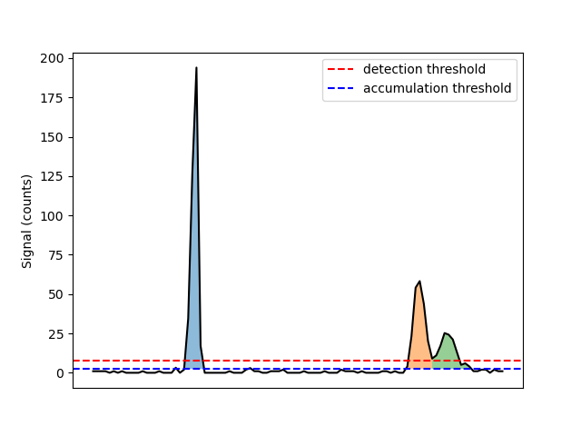
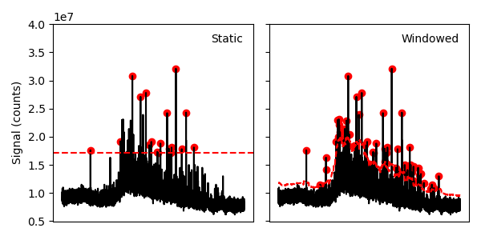
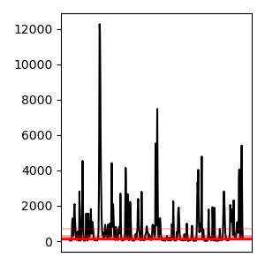

Thresholding Options
====================

.. _accumulation plot:

   Peaks above the :term:`detection threshold` are detected as particles. Merged peaks are split using their prominence.
   Peak regions above the :term:`accumulation threshold`, with at least the :term:`required points` detections, are summed.

To resolve particles from background signals a :term:`detection threshold` must be defined, above with signal is considered a particle.
SPCal offers three different thresholding methods, each with their own use-cases.
In general, Gaussian statistics should be used for thresholding signals with a high-mean background (> 10 counts) and Poisson statistics for those below.
For spICP-ToF data with low-mean backgrounds, Compound-Poisson statistics must be used.
For more a detailed discussion see :ref:`Thresholds for spICP-MS`.
Each method also allows the definition of an error-rate :math:`\alpha`, that corresponds to the expected number of falsely detected particles.

The method used for data can be selected using *Method* in the **Limit Options Dock**, with the following options.

#. Automatic
   Selects the most appropriate of Compound-Poisson, Gaussian and Poisson.

#. Highest
   Selects the highest threshold.

#. Compound-Poisson
   Uses Compound-Poisson statistics with the options in :ref:`Compound-Poisson options`.
   Recommended for ToF data.

#. Gaussian
   Uses Gaussian statistics with the options in :ref:`Gaussian options`.
   Recommended for data with a background signal > 10 counts.

#. Poisson
   Uses Poisson statistics with the options in :ref:`Poisson options`.
   Recommended for data with a background signal < 10 counts.

#. Manual Input
   Set the *Detection threshold* manually for each element.

SPCal also allows editing of the *Accumulation method*, to set the :term:`accumulation threshold`.

#. Detection threshold
   Uses the :term:`detection threshold`, as calculated above, as the :term:`accumulation threshold`.
   This effectively disables the :term:`accumulation threshold`.

#. Signal Mean
   Uses the signal mean as the :term:`accumulation threshold`.

#. Half-detection threshold
   Uses the value half way between the signal mean and :term:`detection threshold`.

Advanced options for detections can be accessed using **Edit -> Processing Options**.
Here you can set the :term:`required points` for a peak, the :term: `required prominence` used to split overlapping peaks and the point at which peak accumulation (summing of adjacent points) will stop.

Compound-Poisson options
------------------------

.. list-table:: Compound-Poisson options in the **Limit Options Dock**.
    :header-rows: 0

    * - :math:`\alpha`
      - The (Type I) :term:`error rate`.
    * - SIA :math:`\sigma`
      - The shape parameter used in the lookup table.

Details on the method used to calculated the :term:`detection threshold` using Compound-Poisson statistics can be found in :ref:`Thresholds for spICP-MS`.
To set per-mass SIA :math:`\sigma` values click the *Single Ion Options* to start the :ref:`Single Ion Distribution Dialog`.
Here a low level (1 - 10 ppb) ionic standard can be loaded and used to determine an SIA shape for each mass.

Single Ion Distribution Dialog
^^^^^^^^^^^^^^^^^^^^^^^^^^^^^^

.. figure:: ../image/usage_sia_dialog.png
   :align: center

   The SIA dialog is used to determine per-mass SIA shapes for compoun Poisson thresholding.

This dialog is used to determine the shape (:math:`\sigma`) for individual masses from a low level ionic standard [2]_.
Once started the dialog will prompt you to load a file then displays the distibution (across all masses) as a histogram and the calculated shapes as a scatter.
Red points are ignored due to low or high zero counts, or from being to far from the mean shape as specifed by *Dist. from mean*.
The blue line shows a fit across masses, from which the SIA is interpolated.
The fit can be modified using the *Smoothing* option.
*Left-clicking* a point will show the ionic signal for that mass, which can be useful for determining why the shape is higher or lower than predicited (e.g., particles in the ionic sample).

Pressing *Apply* will apply the shape to all isotopes and disable the *SIA shape* option under :ref:`Compound-Poisson options`.
To view the SIA for a specific masses hover over the *LOD* option in the **Results Dock**.

Gaussian options
----------------

.. list-table:: Gaussian options in the **Options Tab**.
    :header-rows: 0

    * - :math:`\alpha`
      - The (Type I) :term:`error rate` used to calculate the z-value.
    * - :math:`\sigma`
      - The z-value.

The :term:`detection threshold` is calculated using Gaussian statistics as follows, :math:`\mu + z \sigma`.
The z-value is calculated from :math:`\alpha` using the quantile function of a standard normal distribution.
Editing :math:`\alpha` or :math:`\sigma` will adjust the other value to match.

Poisson options
---------------

.. list-table:: Poisson options in the **Options Tab**.
    :header-rows: 0

    * - :math:`\alpha`
      - The (Type I) :term:`error rate`.
    * - Advanced Options
      - Opens a dialog to select the formula used to calculate the threshold.

The :term:`detection threshold` is calculated using the :math:`\alpha` and the formula selected in *Advanced Options*.
The strengths and weaknesses of each formula are discussed in the MARLAP manual [1]_.
In general, the Currie method is recommended for spICP data.

Windowed thresholding
---------------------

.. _threshold window:

   Windowed thresholding can be used in samples with dynamic background, such as those collected by laser ablation.

A static threshold is easy to calculate and suitable most solution-based spICP-MS data.
However, in situations with dynamic backgrounds, such as when using laser ablation, a thresholding method that can adapt to the moving background is required.
SPCal implements *windowed thresholding* for these cases, and is enabled be checking the *Use window* option in the **Options Tab**.

Windowed thresholding is performed by calculating the local signal mean and :term:`detection threshold` in regions around each point. The size of the window is set using the *Window size* option.
Larger windows are less affected by local changes, but take longer to compute.

Iterative thresholding
----------------------

.. _threshold iter:

   Iterative thresholding can be used to more accurately approximate the mean in samples with many particles.

The presence of a large number of particles can impact the mean of the signal, and therefore the :term:`detection threshold`.
Iterative thresholding removes the influence of particles :term:`detection threshold` by sequentially filtering particle signal and re-calculating using non-detected regions.
Once the :term:`detection threshold` stops changing, the process is ended.

.. [1] United States Environmental Protection Agency, MARLAP Manual Volume III: Chapter 20, Detection and Quantification Capabilities Overview. https://www.epa.gov/sites/default/files/2015-05/documents/402-b-04-001c-20_final.pdf

.. [2] Lockwood, T. E.; Gonzalez de Vega, R.; Schaltt, L.; Clases, D. Accurate thresholding using a compound-Poisson-lognormal lookup table and parameters recovered from standard single particle ICP-TOFMS data. J. Anal. At. Spectrom. 2025, 40, 2633-2640. `<https://doi.org/10.1039/D5JA00230C>`_.
