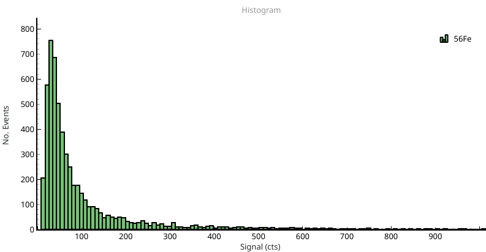
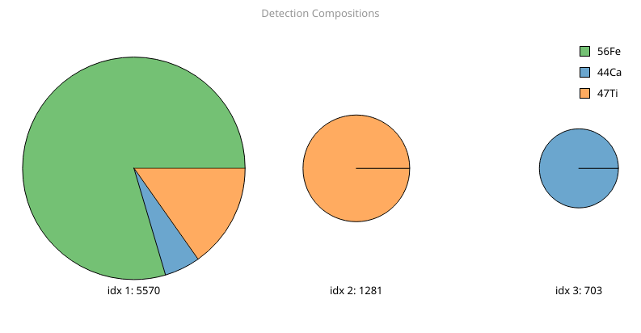
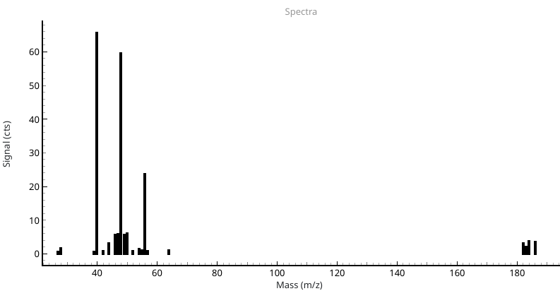
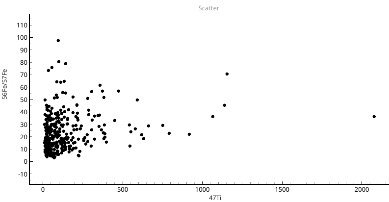
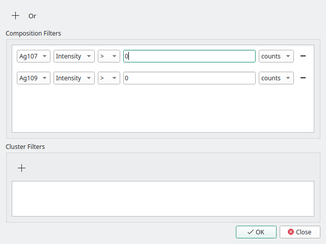

Processing Results
==================

Once a sample has been loaded and particles are detected, results are display in the **Results Dock** and in a variety of views.
These views allow the visualisation of time resolved singals, histograms, clustering results, peak spectra and as scatter plots.
These results will be in counts (signal) unless :ref:`Calibration` to masses and sizes has been performed.

The **Results Dock** shows the number of detections for each isotope in the current data file, the background (points between peaks), the limit of detection, and the particle means, medians and modes.
The units displayed depend on the currently selected *Key* in the top toolbar, *Signal*, *Mass* or *Size*.

Results are also show in the main view area using the currently selected view.
Images or the data in each view can be exported by *Right-clicking* the view and selecting *Export Image* or *Export Data*.
A description of each view is below.

Time Resolved Signals
---------------------

The **Particle View** displays one or all of the isotopes of the currently selected data file.
Signals are plotted as lines and detections as scatter points at peak maxima.
*Right-clicking* the view opens some options such as adding an *exclusion region* to prevent processing in a certain region of the file, as in :numref:`results particle view`.

This view has no graph options.

Histograms
----------

.. _results histogram:

   Histograms of particle signals, masses and sizes are plotted in this view.

THe **Histogram View** is used to plot histgrams of particle signals, masses and sizes.
One or more isotope can be shown at once, and filtered particles (see :ref:`Filtering`) are displayed in gray.
Graphing options can be used to set the histogram bin width, the percentile of the highest bin and whether or not to draw filtered detections.

Compositions
------------

.. _results composition:

   Results of hierarchical agglomerative clustering. The cluster index and size are shown below each cluster result.

The per-particle elemental composition can be calculated using spICP-ToF data and then displayed as a pie or bar chart using the **Composition View**.
Particle compositions are clustered using hierarchical-agglomerative clustering [1]_ and displayed (:numref:`results composition`).
The graph options let you set the *Minimum cluster size* and *Display mode* (bar or pie) for the clustering.
The size of each cluster (number of particles) and index for filtering is shown below.
the *Minimum cluster size* controls the smallest cluster to show (e.g. to prevent single-particle clusters).
The *Distance threshold* sets the minimum distance to merge clusters, and is controlled in the **Edit -> Processing Options** dialog.

Particle Spectra
----------------

.. _results spectra:

   The full mass spectrum of detected particle regions is shown here. By default the background is subtracted.

The **Spectra View** shows the mean of the entire mass spectrum for detected peaks of the currently selected isotope. By default this is background subtracted, but may be controlled using the graph options.
This view loads all masses regardless of the selected isotopes, does not require detection of other masses and is useful for determining what other isotopes a particle may contain.

Scatter Plots
-------------

.. _results scatter:

   A scatter plot of the ratio of iron isotopes (56Fe/57Fe) against 44Ca signals.

The **Scatter View** allows the plotting of any :term:`isotope expression` against another, entered in the fields in the main toolbar.
In example :numref:`results scatter` the ratio of 56Fe to 57Fe is plotted against calcium.
If data is calibrated then masses and sizes may also be plot.

This view has no graph options.

Filtering
---------

.. _results filter:

   The filter dialog can be used to restrict analysis of particles using a combination of boolean AND and OR operations.
   Additionally, data can be filtered using the cluster index following hierarchical agglomerative clustering.

The **Filtering Dialog** is started from the main toolbar and can be used to select particles with certain characteristics.
Particles can be selected based on their signal, mass or size for one or more elements, using boolean (AND, OR) operations.
The example in :numref:`results filter` uses the boolean AND of the two silver isotopes, 107 and 109, with signals greater than 0 counts.
This filters particle detections and results to only those that contain both silver isotopes.

An example of filtering can be found in the :ref:`Particle Compositions on an ICP-ToF` tutorial.

.. [1] Tharaud, M.; Schlatt, L.; Shaw, P.; Benedetti, M. F. Nanoparticle Identification Using Single Particle ICP-ToF-MS Acquisition Coupled to Cluster Analysis. From Engineered to Natural Nanoparticles. J. Anal. At. Spectrom. 2022, 37, 2042–2052. https://doi.org/10.1039/D2JA00116K.
