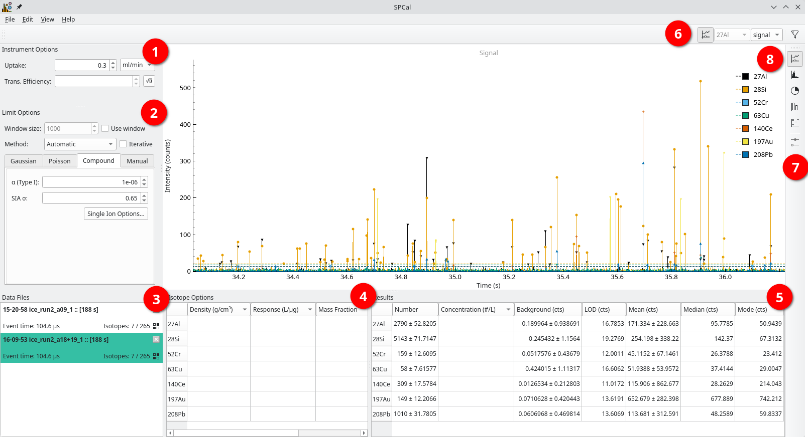

Basic Overview
==============

.. _overview:

   The main SPCal window with a TOF data file loaded. |c1| Instrument specific options. |c2| Limit (thresholding) options. |c3| Currently loaded data files. |c4| Isotope specific options. |c5| Results summary. |c6| The main toolbar. |c7| The view toolbar. |c8| The main view, showing particle data.

The SPCal GUI consists of a main window where data is plotted (:nuref:`overview` |c8|) with several moveable docks (:numref:`overview` |c1| to |c5|) and two toolbars (:numref:`overview` |c6| and |c7|).
Docks can be reorganised or hidden to make a layout thats suits you. This layout is saved on exit and restored when SPCal starts.
To restore hidden docks use **View -> Show/hide dock widgets** and to restore the default layout **View -> Restore Default Layout**.

Descriptions of each dock can be found below.

Instrument Options
------------------

This dock displays instrument specific options that are used during calibration of signals to masses and sizes.
The *Uptake* is the sample :term:`uptake`, in the displayed units.
The *Trans. Efficiency* is the :term:`transport efficiency`, a value between 0 and 1 that represents the fraction of particles in a sample that reach the plasma. See :ref:`Calibration` for more information.
To calculate the :term:`transport efficiency` use the button next to *Trans. Efficiency*.
This button is active once particles are detected and the :term:`uptake` is specified. 

Limit Options
-------------

A dock containing options specific to the thresholding of data.
See :ref:`Thresholding Options` for details on each method and :ref:`Thresholds for spICP-MS` for background and theory.

Data Files
----------

A list of data files currently loaded into SPCal, with their names, total length in seconds, event time and isotopes.
Files can be closed using the button in the top right and isotopes (re)selected using the button in the bottom left.
*Right-clicking* the file will open a context menu allowing access to the isotope selection and additional information.

Selecting multiple files (with Shift) will cause all selected files to be plot in the main view (:numref:`overview` |c8|).

Isotope Options
---------------

This dock displays options specific to individial isotopes.
The :term:`density` can be selected using the :ref:`Density Database` by *right-clicking* the density field.
Similarly, the :term:`mass fraction` can be selected using the :ref:`Mass Fraction Calculator` by *right-clicking* the mass fraction field.
The mass fraction can also be calculated by inputing the molecular formula directly into the field, with the isotope of interest first (e.g., as ``FeO3`` for the iron fraction or as ``O3Fe`` for the oxygen fraction).

While a method may contain more isotope options, only isotopes selected for the current file are displayed here.

Results
-------

A summary of the particle detection results for the selected data file.
By changing the *Key* in the :ref:`Main Toolbar` (:numref:`overview` |c6|) the particle results can be display in *Signal*, *Mass* or *Size*.
Values for isotopes that cannot be calibrated to the required *Key* will be left blank.
The display units can be changed by *left-clicking* the header.

*Right-clicking* the isotope labels on the left will open a context menu with new options.
Here, you can remove an isotope or :term:`isotope expression` or easily sum the selected isotopes.

Main Toolbar
------------

The main toolbar has four components.
From left to right (:numref:`overview` |c6|): a button for plotting all isotopes, the current isotope, the current *Key* and a button to start the :ref:`Filtering` dialog.

View Toolbar
------------

The view toolbar is used to select the curent view (graph) shown in the :ref:`Main View Area` (:numref:`overview` |c8|).
The final button is active for certain views, when graphing options are available.

Main View Area
--------------

Here data and results are displayed.
The specific view can be selected using the :ref:`View Toolbar`.

.. |c1| unicode:: U+2460
.. |c2| unicode:: U+2461
.. |c3| unicode:: U+2462
.. |c4| unicode:: U+2463
.. |c5| unicode:: U+2464
.. |c6| unicode:: U+2465
.. |c7| unicode:: U+2466
.. |c8| unicode:: U+2467
